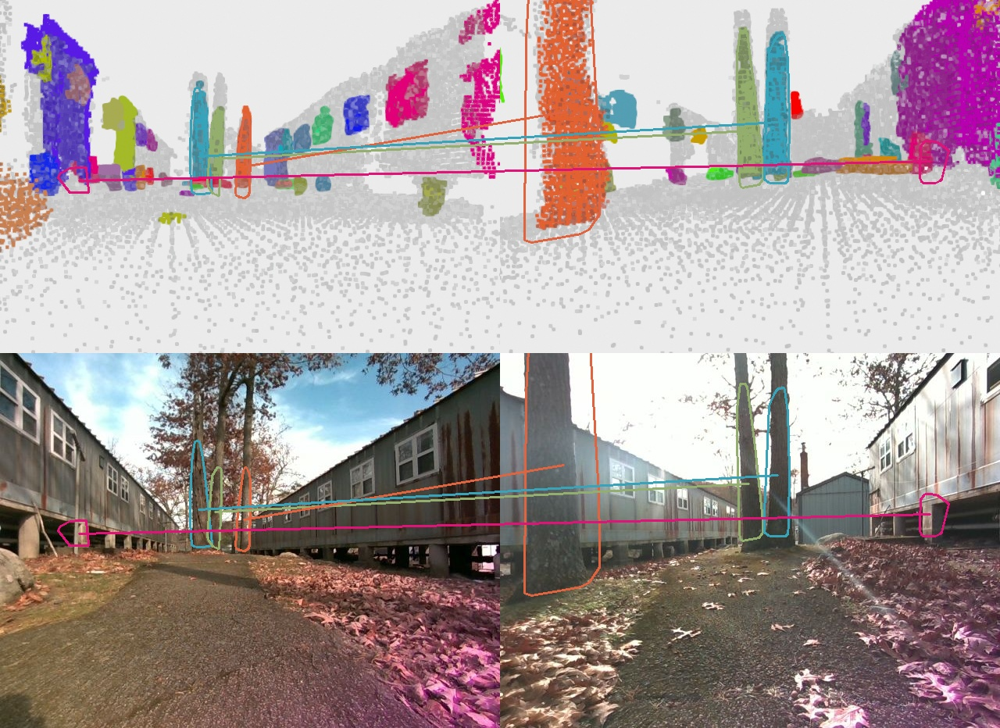

# ROMAN ROS2

This is ROS wrapper code for running `roman` mapping real-time.



Welcome to roman_ros2, a ROS2 wrapper for [ROMAN](https://acl.mit.edu/ROMAN/) (<ins>R</ins>obust <ins>O</ins>bject <ins>M</ins>ap <ins>A</ins>lignment A<ins>n</ins>ywhere).
ROMAN is a view-invariant global localization method that maps open-set objects and uses the geometry, shape, and semantics of objects to find the transformation between a current pose and previously created object map.
This enables loop closure between robots even when a scene is observed from *opposite views.*

## Citation

If you find ROMAN useful in your work, please cite our paper:

M.B. Peterson, Y.X. Jia, Y. Tian and J.P. How, "ROMAN: Open-Set Object Map Alignment for Robust View-Invariant Global Localization,"
*arXiv preprint arXiv:2410.08262*, 2024.

```
@article{peterson2024roman,
  title={ROMAN: Open-Set Object Map Alignment for Robust View-Invariant Global Localization},
  author={Peterson, Mason B and Jia, Yi Xuan and Tian, Yulun and Thomas, Annika and How, Jonathan P},
  journal={arXiv preprint arXiv:2410.08262},
  year={2024}
}
```

# Install

In the root directory of your ROS workspace run:

```
cd src
git clone git@github.com:mit-acl/roman_ros.git
git clone git@github.com:Box-Robotics/ros2_numpy.git
cd ..
colcon build
```

---

This research is supported by Ford Motor Company, DSTA, ONR, and
ARL DCIST under Cooperative Agreement Number W911NF-17-2-0181.