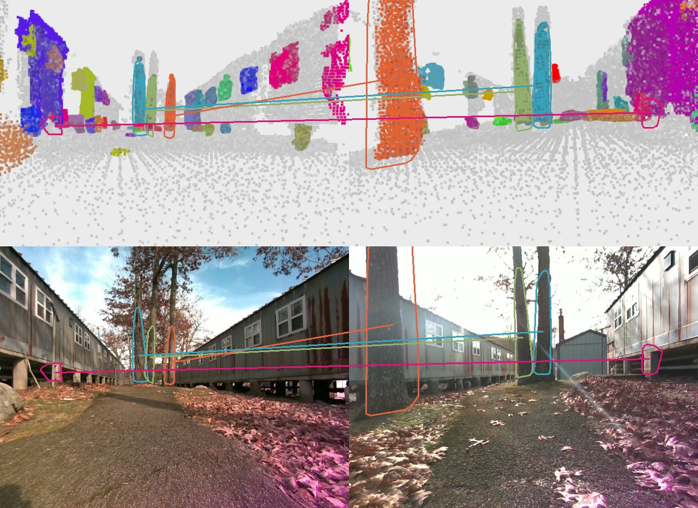

# ROMAN ROS



Welcome to roman_ros, a ROS wrapper for [ROMAN](https://acl.mit.edu/ROMAN/) (<ins>R</ins>obust <ins>O</ins>bject <ins>M</ins>ap <ins>A</ins>lignment A<ins>n</ins>ywhere).
ROMAN is a view-invariant global localization method that maps open-set objects and uses the geometry, shape, and semantics of objects to find the transformation between a current pose and previously created object map.
This enables loop closure between robots even when a scene is observed from *opposite views.*

Demo videos, the paper, and more can be found at the [ROMAN project website](https://acl.mit.edu/ROMAN-project/). 
Checkout the ros2 branch for the ROS2 wrapper.

## Citation

If you find ROMAN useful in your work, please cite our paper:

M.B. Peterson, Y.X. Jia, Y. Tian and J.P. How, "ROMAN: Open-Set Object Map Alignment for Robust View-Invariant Global Localization,"
*arXiv preprint arXiv:2410.08262*, 2024.

```
@article{peterson2024roman,
  title={ROMAN: Open-Set Object Map Alignment for Robust View-Invariant Global Localization},
  author={Peterson, Mason B and Jia, Yi Xuan and Tian, Yulun and Thomas, Annika and How, Jonathan P},
  journal={arXiv preprint arXiv:2410.08262},
  year={2024}
}
```

# Install

First, install the ROMAN python package using the install directions [here](https://github.com/mit-acl/ROMAN?tab=readme-ov-file#install).

Then, in the root directory of your ROS workspace run:

```
cd src
git clone git@github.com:mit-acl/roman_ros.git
git clone git@github.com:eric-wieser/ros_numpy.git
cd ..
catkin build
```

# Running with D455 and Kimera-VIO

An example is provided running a D455 with Kimera-VIO for odometry. 
This example works with Kimera-Multi Data available [here](https://github.com/MIT-SPARK/Kimera-Multi-Data).

```
export ROBOT=<robot name>
export CAMERA=<camera name>
export BAG=<path to bag file>
export ROMAN_WS=<path to workspace where roman_ros is installed>
export KIMERA_WS=<path to workspace where Kimera-VIO is installed>
export ACTIVATE_ROMAN_ENV=<command to activate python environment where roman is installed>
tmuxp load ./tmux/example.yaml
```

---

This research is supported by Ford Motor Company, DSTA, ONR, and
ARL DCIST under Cooperative Agreement Number W911NF-17-2-0181.